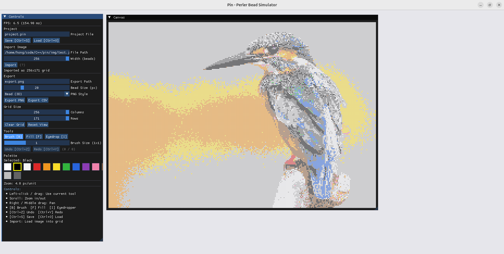
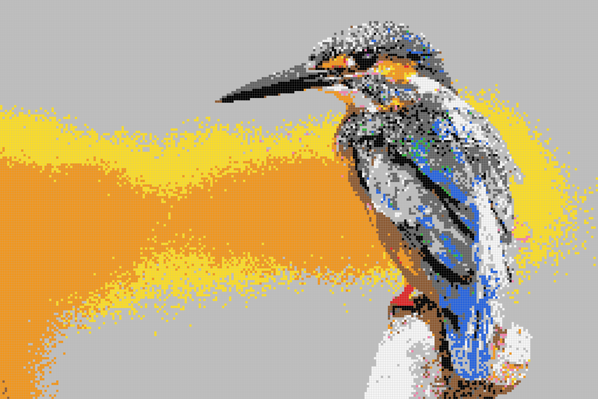
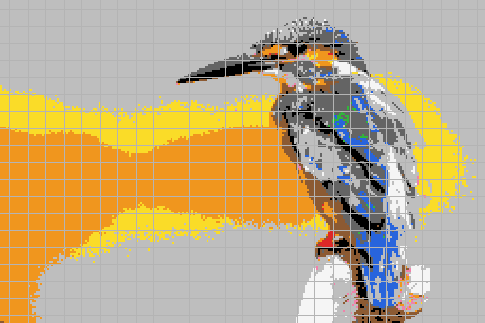

# Pin — Perler Bead Simulator

A desktop perler bead (拼豆) simulator built with C++17, OpenGL 3.3 and Dear ImGui.
Import any image, convert it to a bead pattern, edit with intuitive tools, and export
your design as a PNG or CSV bead count sheet.



## Features

- **Image Import** — Load PNG / JPG / BMP / TGA and auto-convert to a bead grid with
  nearest-neighbour colour matching. Two down-sampling algorithms are available:
  - **Point Sample** — Takes the centre pixel of each source region (fast)
  - **Area Average** — Averages all pixels in the source region (better detail retention)
- **Native File Dialogs** — System-native Open / Save dialogs for importing images,
  loading / saving projects, and exporting (via tinyfiledialogs)
- **Editing Tools** — Brush (size 1×1 / 3×3 / 5×5), Flood Fill, Eyedropper
- **Bresenham Brush Interpolation** — Fast mouse strokes are gap-free thanks to
  line interpolation between frames
- **Colour Palette** — 12 configurable bead colours loaded from an external JSON file
  (`etc/palette.json`)
- **Undo / Redo** — Snapshot-based history (up to 100 steps), brush strokes grouped as
  a single undo unit
- **Project Save / Load** — `.pin` JSON format preserving grid data and palette
- **Export** — PNG (Flat grid or 3D bead style) and CSV bead count report
- **Zoom & Pan** — Scroll to zoom, right / middle-click drag to pan
- **GPU-Cached Rendering** — Bead grid is rendered to an off-screen OpenGL texture and
  only rebuilt when data changes, keeping idle / zoom / pan at minimal cost





## Keyboard Shortcuts

| Shortcut | Action |
|----------|--------|
| `B` | Brush tool |
| `F` | Flood Fill tool |
| `I` | Eyedropper tool |
| `Ctrl+Z` | Undo |
| `Ctrl+Y` / `Ctrl+Shift+Z` | Redo |
| `Ctrl+S` | Save project |
| `Ctrl+O` | Load project |
| Scroll wheel | Zoom in / out |
| Right / Middle drag | Pan |

## Requirements

- **OS** — Linux (tested on Ubuntu)
- **Compiler** — GCC or Clang with C++17 support
- **CMake** ≥ 3.10
- **GLFW** ≥ 3.3 (system-installed)
- **OpenGL** ≥ 3.3
- **ccache** (optional, for faster rebuilds)

All other dependencies are bundled under `lib/`:

| Library | Purpose |
|---------|---------|
| [Dear ImGui](https://github.com/ocornut/imgui) | Immediate-mode GUI |
| [nlohmann/json](https://github.com/nlohmann/json) | JSON parsing |
| [spdlog](https://github.com/gabime/spdlog) | Logging |
| [stb_image / stb_image_write](https://github.com/nothings/stb) | Image I/O |
| [tinyfiledialogs](http://tinyfiledialogs.sourceforge.net) | Native file dialogs |

## Build & Run

```bash
# Install system dependencies (Ubuntu / Debian)
sudo apt install build-essential cmake libglfw3-dev ccache zenity

# Configure and build
cmake -B build -DCMAKE_BUILD_TYPE=Release
cmake --build build -j$(nproc)

# Run
./bin/PerlerBeadSimulator
```

## Project Structure

```
pin/
├── src/
│   ├── main.cpp                  # Entry point & main loop
│   ├── app/                      # Window, Canvas, UI panels
│   ├── core/                     # BeadGrid, Palette, Undo, Import/Export
│   ├── rendering/                # GridRenderer, BeadTextureCache
│   └── logging/                  # spdlog logger wrapper
├── include/                      # Header files (mirrors src/)
├── etc/
│   ├── config.json               # Window size, log level
│   └── palette.json              # Bead colour definitions
├── lib/                          # Bundled third-party libraries
├── img/                          # Screenshots
└── CMakeLists.txt
```

## Configuration

### `etc/config.json`

```json
{
    "logger_level": 1,
    "window": { "width": 1280, "height": 720, "title": "Pin - Perler Bead Simulator" }
}
```

### `etc/palette.json`

Defines the available bead colours. Each entry has a `name` and an `[R, G, B]` colour
value. Index 0 is always reserved for "Empty" (no bead). You can freely add, remove or
reorder colours.

## Image Credits

The sample image `img/test.jpg` is used under the
[Unsplash License](https://unsplash.com/license):

> **Blue Kingfisher** — Hunei District, Taiwan
> Published on February 6, 2017 · Canon EOS REBEL T3i
> Free to use under the Unsplash License

## License

This project is licensed under the [MIT License](LICENSE).
