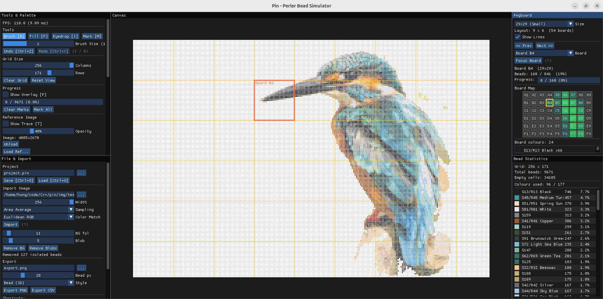
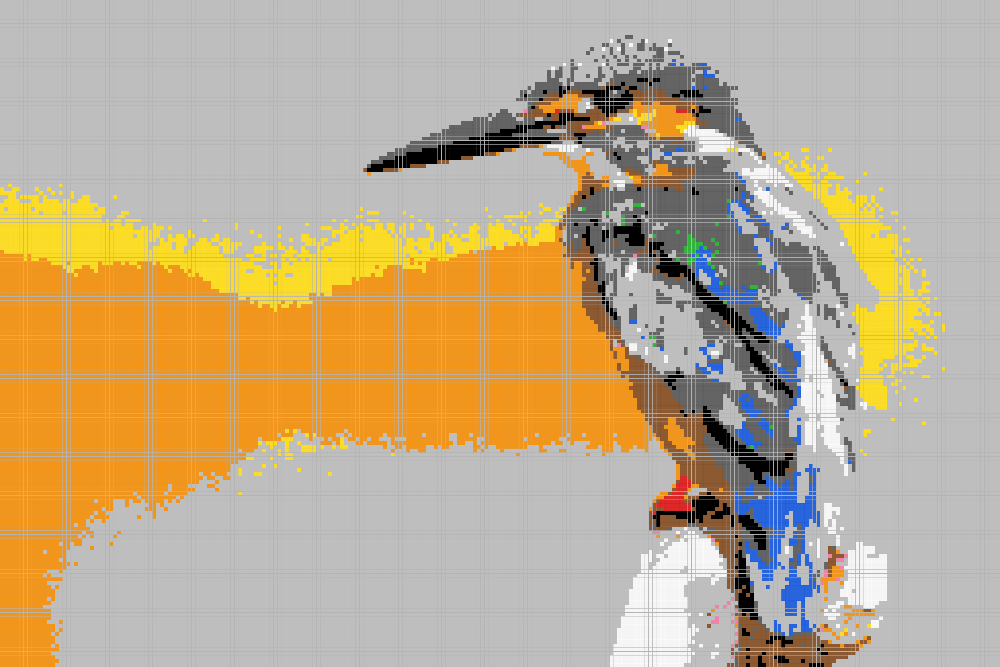
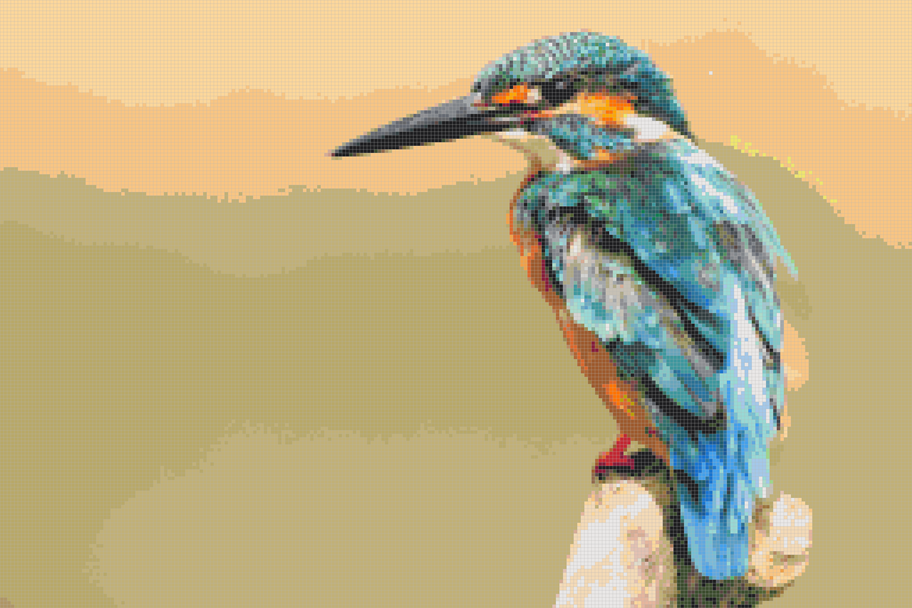
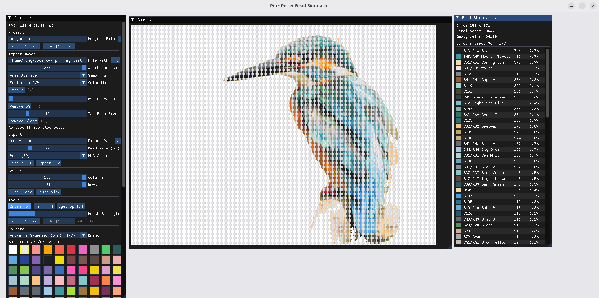
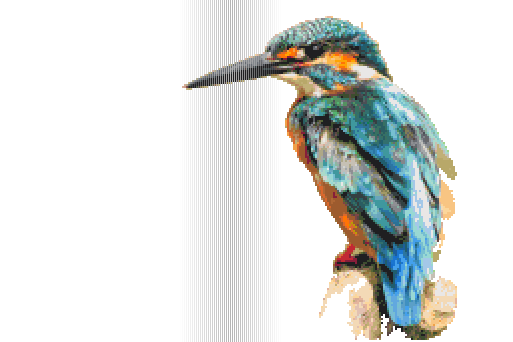

# Pin — Perler Bead Simulator

A desktop perler bead (拼豆) simulator built with C++17, OpenGL 3.3 and Dear ImGui.
Import any image, convert it to a bead pattern, edit with intuitive tools, manage
pegboards, track assembly progress, and export your design as a PNG or CSV bead
count sheet.



## Features

### Image Import & Conversion
- **Image Import** — Load PNG / JPG / BMP / TGA and auto-convert to a bead grid.
  Two down-sampling algorithms and two colour-matching algorithms are available:
  - **Sampling** — Point Sample (centre pixel) or Area Average (better detail)
  - **Color Match** — Euclidean RGB or Redmean (perceptually weighted)
- **Background Removal** — Edge flood-fill removes the background from imported images.
  Adjustable colour-distance tolerance adapts to gradual background gradients.
  A separate "Remove Blobs" pass cleans up isolated small regions left behind
- **Reference Overlay (Trace)** — After importing an image it is automatically loaded
  as a semi-transparent layer on top of the bead canvas. Adjust opacity (0–100%)
  or manually load any image as a reference. Toggle with `[T]`

### Editing
- **Tools** — Brush (size 1×1 / 3×3 / 5×5), Flood Fill, Eyedropper, Mark Done
- **Bresenham Brush Interpolation** — Fast mouse strokes are gap-free thanks to
  line interpolation between frames
- **Multi-Brand Palette** — Switch between bead brands at runtime via a drop-down:
  - **Perler** (42 colours), **Hama** (36 colours), **Artkal** (43 colours), **Nabbi** (27 colours)
  - Palette files live in `etc/palettes/` (JSON); add your own brand by dropping in a new file
- **Undo / Redo** — Delta-based history (up to 100 steps) that stores only the cells
  that changed, keeping memory usage minimal even for large grids. Brush strokes are
  grouped as a single undo unit

### Pegboard Management
- **Automatic Tiling** — Grid is automatically divided into pegboard-sized tiles
  (29×29 or 57×57). Navigate between boards via prev/next buttons, a drop-down,
  or a clickable mini-map
- **Board Overlay** — Yellow grid lines show pegboard boundaries on the canvas;
  the selected board is highlighted with a thicker orange outline
- **Focus Board** — Zoom and centre the canvas view on any specific board

### Progress Tracking
- **Mark Done Tool** `[M]` — Click or drag to mark beads as physically placed;
  supports brush sizes for bulk marking
- **Visual Overlay** `[P]` — Completed beads show a semi-transparent green tint
  with a ✓ checkmark on the canvas
- **Progress Bar** — Real-time done/total percentage in the Tools panel and
  per-board progress in the Pegboard panel
- **Persistent** — Progress data is saved and restored with `.pin` project files

### Project & Export
- **Project Save / Load** — `.pin` JSON format preserving grid data, palette, and
  progress tracking state
- **Export** — PNG (Flat grid or 3D bead style) and CSV bead count report
- **Bead Statistics** — Dedicated panel showing colour usage counts, percentages,
  and total bead summary
- **Native File Dialogs** — System-native Open / Save dialogs via tinyfiledialogs

### Rendering & Layout
- **GPU-Cached Rendering** — Bead grid is rendered to an off-screen OpenGL texture and
  only rebuilt when data changes, keeping idle / zoom / pan at minimal cost
- **Zoom & Pan** — Scroll to zoom, right / middle-click drag to pan
- **Dynamic Layout** — Five-panel responsive layout that adapts proportionally to
  window resizing (minimum 800×500). Side panels clamp within comfortable ranges










## Keyboard Shortcuts

| Shortcut | Action |
|----------|--------|
| `B` | Brush tool |
| `F` | Flood Fill tool |
| `I` | Eyedropper tool |
| `M` | Mark Done tool (progress tracking) |
| `P` | Toggle progress overlay |
| `T` | Toggle reference (trace) overlay |
| `Ctrl+Z` | Undo |
| `Ctrl+Y` / `Ctrl+Shift+Z` | Redo |
| `Ctrl+S` | Save project |
| `Ctrl+O` | Load project |
| Scroll wheel | Zoom in / out |
| Right / Middle drag | Pan |

## Requirements

- **OS** — Linux (tested on Ubuntu)
- **Compiler** — GCC or Clang with C++17 support
- **CMake** ≥ 3.10
- **GLFW** ≥ 3.3 (system-installed)
- **OpenGL** ≥ 3.3
- **ccache** (optional, for faster rebuilds)

All other dependencies are bundled under `lib/`:

| Library | Purpose |
|---------|---------|
| [Dear ImGui](https://github.com/ocornut/imgui) | Immediate-mode GUI |
| [nlohmann/json](https://github.com/nlohmann/json) | JSON parsing |
| [spdlog](https://github.com/gabime/spdlog) | Logging |
| [stb_image / stb_image_write](https://github.com/nothings/stb) | Image I/O |
| [tinyfiledialogs](http://tinyfiledialogs.sourceforge.net) | Native file dialogs |

## Build & Run

```bash
# Install system dependencies (Ubuntu / Debian)
sudo apt install build-essential cmake libglfw3-dev ccache zenity

# Configure and build
cmake -B build -DCMAKE_BUILD_TYPE=Release
cmake --build build -j$(nproc)

# Run
./bin/PerlerBeadSimulator
```

## Project Structure

```
pin/
├── src/
│   ├── main.cpp                  # Entry point & main loop
│   ├── app/                      # Window, Canvas, Layout, UI panels
│   │   ├── canvas.cpp            #   Zoom/pan canvas widget
│   │   ├── canvas_panel.cpp      #   Centre panel (bead canvas + overlays)
│   │   ├── tools_panel.cpp       #   Left-upper (tools, palette, progress, reference)
│   │   ├── file_panel.cpp        #   Left-lower (project, import, export, help)
│   │   ├── pegboard_panel.cpp    #   Right-upper (pegboard nav, mini-map)
│   │   ├── stats_panel.cpp       #   Right-lower (bead statistics)
│   │   ├── config.cpp            #   JSON config loader
│   │   ├── file_dialog.cpp       #   Native file dialog wrapper
│   │   └── window.cpp            #   GLFW window wrapper
│   ├── core/                     # Domain logic
│   │   ├── bead_grid.cpp         #   Grid data model + tools
│   │   ├── palette.cpp           #   Colour palette
│   │   ├── undo_manager.cpp      #   Delta-based undo/redo
│   │   ├── image_importer.cpp    #   Image → grid conversion
│   │   ├── exporter.cpp          #   PNG / CSV export
│   │   ├── project_file.cpp      #   .pin save/load
│   │   ├── pegboard_manager.cpp  #   Board tiling logic
│   │   └── progress_tracker.cpp  #   Assembly progress tracking
│   ├── rendering/                # GPU rendering
│   │   ├── bead_texture_cache.cpp#   FBO-cached bead texture
│   │   ├── grid_renderer.cpp     #   Grid line renderer
│   │   └── reference_overlay.cpp #   Reference image GPU texture
│   └── logging/                  # spdlog logger wrapper
├── include/                      # Header files (mirrors src/)
│   └── app/layout.h              #   Dynamic 5-panel layout manager
├── etc/
│   ├── config.json               # Window size, log level
│   └── palettes/                 # Brand palette files (auto-discovered)
│       ├── perler.json
│       ├── hama.json
│       ├── artkal.json
│       └── nabbi.json
├── lib/                          # Bundled third-party libraries
├── img/                          # Screenshots
└── CMakeLists.txt
```

## Configuration

### `etc/config.json`

```json
{
    "logger_level": 1,
    "window": { "width": 1280, "height": 720, "title": "Pin - Perler Bead Simulator" }
}
```

### `etc/palettes/*.json`

Each JSON file in `etc/palettes/` defines one bead brand's colour set. The application
auto-discovers all `.json` files in this directory at startup.

```json
{
    "brand": "Perler",
    "size": "Midi (5mm)",
    "palette": [
        { "name": "Black", "color": [0, 0, 0] },
        { "name": "White", "color": [241, 241, 241] }
    ]
}
```

- `brand` / `size` — displayed in the UI drop-down (optional; filename is used as
  fallback)
- `palette` — array of `{ name, color: [R, G, B] }` entries. Index 0 is always
  reserved for "Empty" (auto-inserted). You can freely add, remove or reorder colours.

To add a new brand, simply drop a `.json` file into `etc/palettes/` — no code changes
required.

## Image Credits

The sample image `img/test.jpg` is used under the
[Unsplash License](https://unsplash.com/license):

> **Blue Kingfisher** — Hunei District, Taiwan
> Published on February 6, 2017 · Canon EOS REBEL T3i
> Free to use under the Unsplash License

## License

This project is licensed under the [MIT License](LICENSE).
